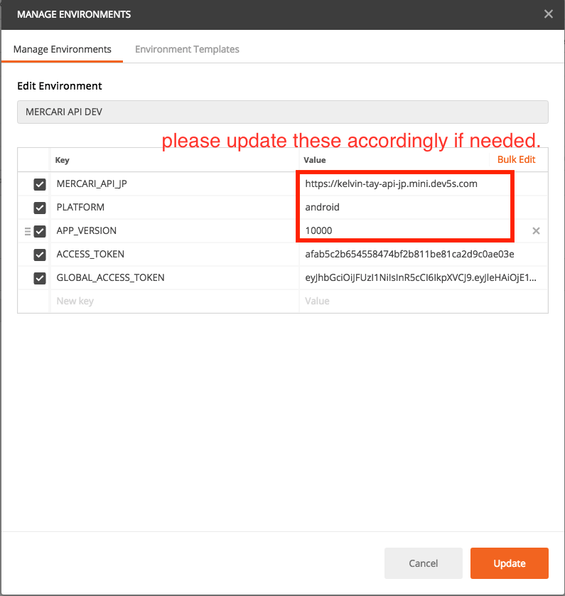
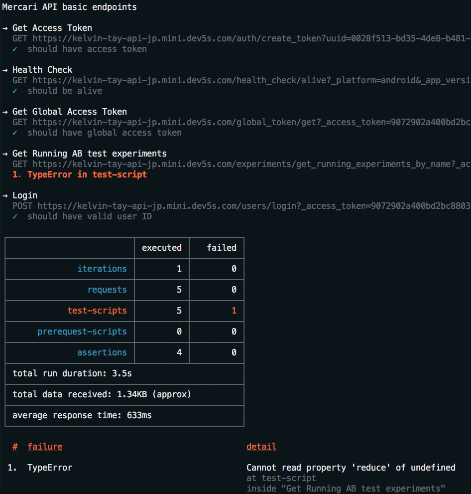

# Postman Collections :envelope:

> for Mercari API :jp:

## Setup

You can import the collections here, as well as the enviromments for ease of testing.

Please take note to change the environment settings according to your own local setup.

Reference:



## Running Tests

We suggest using [newman](https://github.com/postmanlabs/newman).

```shell
newman run ./environments/MERCARI\ API\ DEV.postman_environment.json  ./collections/Mercari\ API\ basic\ endpoints.postman_collection.json 
```

> Sample output




## Todo

- [ ] add more API endpoint examples
- [ ] Japanese translation (if needed)
